<<<<<<< HEAD
【项目实战】智能零售商品检测（训练详解+优化部署策略+大型数据开源）基于EfficientDet Pytorch 


## 前言

   这两天我CV调包侠帮助自己深度学习交流群的朋友做一个智能零售的企业级项目，我帮助他完成了零售商品检测的基本迭代一，已经轻松地完成了Yolo系列的训练，比如Yolov5 和Yolov3，Efficientdet是一个优秀的目标检测算法，速度与精度并存的实时性目标检测算法，我们今天就手把手教学一次，小白也能懂~，接触不久，如有错误，请指出。github传送门：https://github.com/CVUsers/Smart-Retail-By-Efficientdet欢迎star


(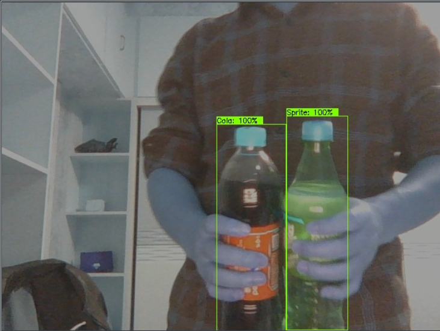

## 何为Efficientdet

这里引用：https://zhuanlan.zhihu.com/p/98784755

introduction介绍了两大挑战：（1）高效的多尺度特征融合，FPN之后，PANet、NAS-FPN提出跨尺度的特征融合，但是之前的工作是直接将它们无差别得加起来，作者认为不同尺度特征图重要性不同，因此提出加权双向FPN，权值是可以学习的参数。（2）模型缩放，类似于efficientnet，对模型分辨率、深度、宽度联合缩放。本文核心方法BiFPN+compound scaling（联合缩放）

(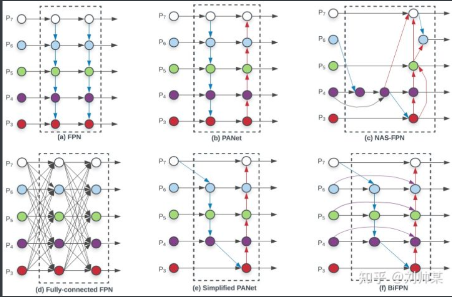图1 Feature network design

3.2 跨尺度连接

​       由于PANet的accuracy比FPN和NAS-FPN更高，但是也有更高的计算量和参数量，因此文本提出了几种优化方法：（1）由于只有一条输入边的连接没有特征融合的功能，因此直接删掉，得到图1(e)。（2）在同尺度特征图上加入了一个输入到输出的连接（如果没有的话），在增加很少计算量的情况下就融合特征，得到图1(f)，（3）不同于PANet只有一条top-down和一条bottom-up路径，本文将这个结构视为一个特征网络层，并将这一特征网络层重复多次得到更高层次的特征融合。整个网络结构如图2所示。

图2 EfficientDet architecture

3.3 加权特征融合

之前的工作在不同分辨率的特征图融合的时候往往是直接resize，再相加，这将所有输入的贡献视为相同的。本文总结了3种加权feature fusion方法，（1）unbound fusion ![[公式]](https://www.zhihu.com/equation?tex=O%3D%5CSigma_%7Bi%7D%5Comega_%7Bi%7D+%5Ccdot+I_%7Bi%7D) , ![[公式]](https://www.zhihu.com/equation?tex=%5Comega_%7Bi%7D)  是learnable权重，是一个标量（对每个特征图），向量（对每个通道），tensor（对每个像素），弊端：由于权重unbound，训练不稳定。（2）将之前的权重经过softmax转换到0~1，但是实验表明在CPU上计算很慢。（3）本文提出的快速正则化融合： ![[公式]](https://www.zhihu.com/equation?tex=O%3D%5CSigma_%7Bi%7D+%5Cfrac%7B%5Comega_%7Bi%7D%7D%7B%5Cepsilon%2B%5CSigma_%7Bj%7D+%5Comega_%7Bj%7D%7D+%5Ccdot+I_%7Bi%7D) ，其中 ![[公式]](https://www.zhihu.com/equation?tex=%5Comega_%7Bi%7D%5Cgeq0) ，因为经过了ReLU激活函数， ![[公式]](https://www.zhihu.com/equation?tex=%5Cepsilon) 是个极小值，号称在CPU上比sofemax快30%。

经过BiFPN和fast normalized fusion，以图1(f)中的 ![[公式]](https://www.zhihu.com/equation?tex=P_%7B6%7D) 为例，feature fusion如图3所示

(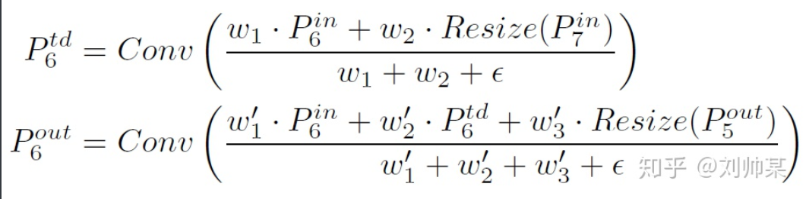图3

4.2 Combound Scaling

联合缩放是为了accuracy和efficiency的tradeoff，之前的工作大多放大backbone、输入图片、或者堆叠更多的FPN，这些工作只放大其中的一项，是比较低效的。因此本文提出一种联合缩放方法，来联合放大backbone、BiFPN、分类/回归子网络和分辨率。（1）backbone复用了efficientnet-B0至B6。（后面不想写了，意义不大）

(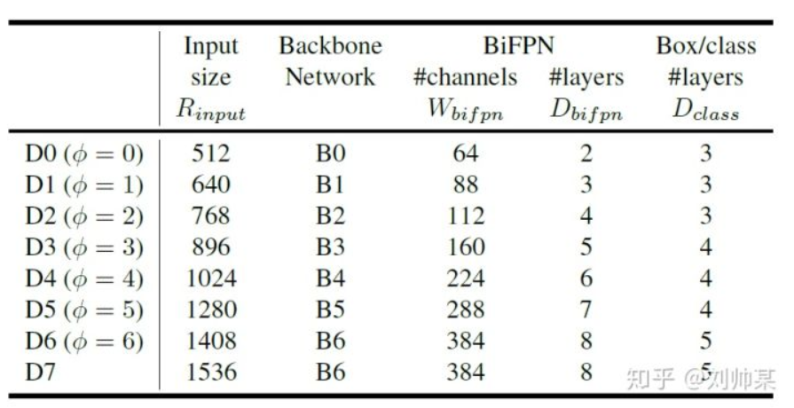图4 缩放后的模型尺寸

感受：

（1）. batch size=128，用了32个TPUv3训的model，直接和YOLOv3比似乎有点不公平，最终efficientDet-B0也不一定能超过YOLOv3很多，看之后源码和模型吧

（2）. 这个计算量一般人做不了，有时间还是多研究一下YOLOv3吧

大家可以看一下Efficientdet的疯狂刷榜：
(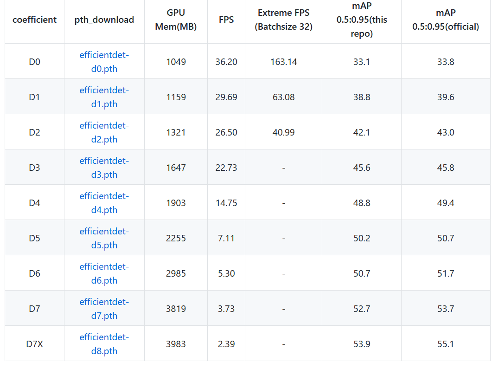

**话不多说 开始训练**

## 1 数据准备

由于cv调包侠这几天台式机有任务了，我便使用了开源的服务器：天池的服务器进行一个baseline的训练，我使用的是朋友自己标注的数据：**可乐与雪碧检测与识别**。

请看测试集与效果~

(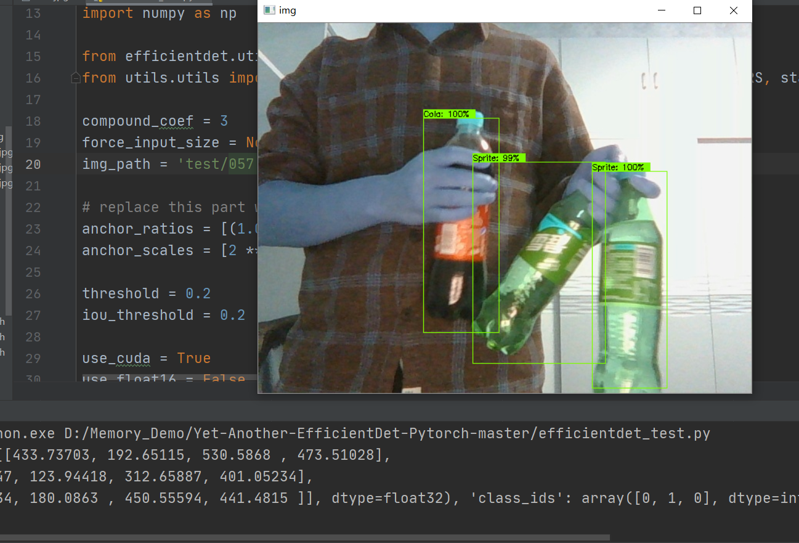

只是做了个baseline，**其中这还有一份数据集：大型零售商品检测识别的数据集，还标注好了哟~客官请看，后续可以用大型数据做训练**

(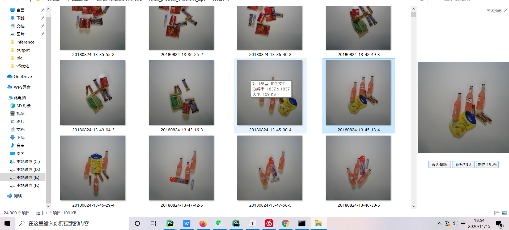

(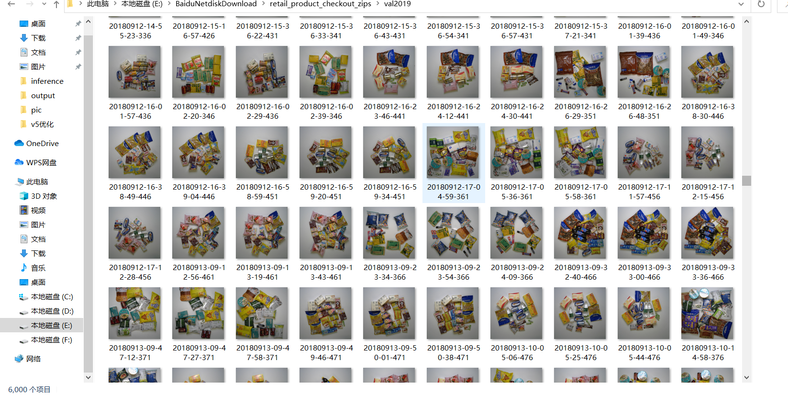

(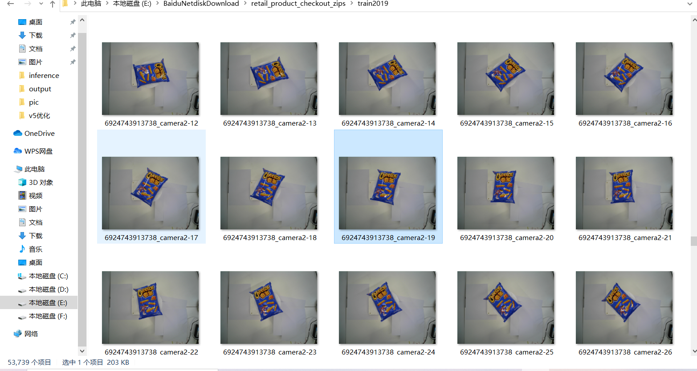

## 数据标注

#### 附上自己的Lablimg简易教学：

(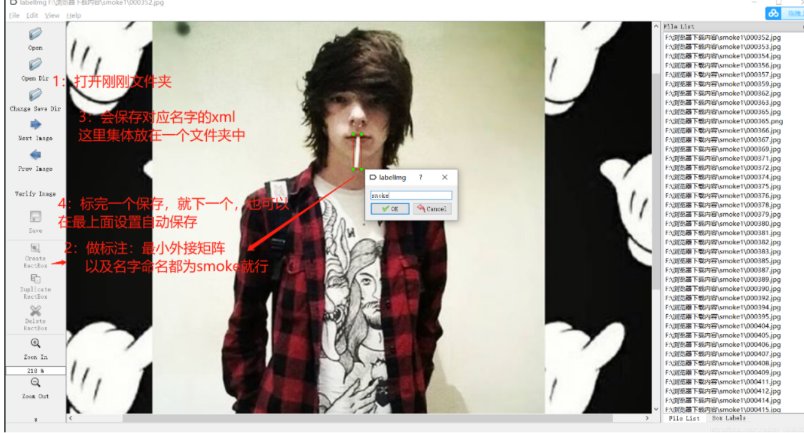

标注好会生成XML文件：XML里面包含了四个点坐标和图片的名字与size。

然后就会获取xml文件（这幅图是以前吸烟检测的时时候做的，一个道理~）


## 将XML转换成COCO JSON格式

代码我跑已经写好了，见github中：https://github.com/CVUsers/Smart-Retail-By-Efficientdet

中data/coco2017下的2COCO.py

```python 
def DIOR_Dataset(image_path, annotation_path, start_image_id=0, start_id=0):
    categories_dict = generate_categories_dict(DIOR_CATEGORIES)

    imgname = os.listdir(image_path)
    images_dict = generate_images_dict(imgname, image_path, start_image_id)

    print('GENERATE_ANNOTATIONS_DICT...')
    annotations_dict = []
    id = start_id
    for i in images_dict:
        image_id = i['id']
        image_name = i['file_name']
        annotation_xml = annotation_path + image_name.split('.')[0] + '.xml'

        tree = ET.parse(annotation_xml)
        root = tree.getroot()

        for j in root.findall('object'):
            category = j.find('name').text
            print(category)
            category_id = DIOR_CATEGORIES.index(category)
            x_min = float(j.find('bndbox').find('xmin').text)
            y_min = float(j.find('bndbox').find('ymin').text)
            w = float(j.find('bndbox').find('xmax').text) - x_min
            h = float(j.find('bndbox').find('ymax').text) - y_min
            bbox = [x_min, y_min, w, h]
            dict = {'image_id': image_id, 'iscrowd': 0, 'bbox': bbox, 'category_id': category_id + 1, 'id': id}
            annotations_dict.append(dict)
            id = id + 1
    print('SUCCESSFUL_GENERATE_DIOR_JSON')
    return {COCO_DICT[0]: images_dict, COCO_DICT[1]: annotations_dict, COCO_DICT[2]: categories_dict}

```

这里就是xml转json的函数，看到我们35行写了

```python
DIOR_CATEGORIES = ['Sprite', 'Cola']
parser = argparse.ArgumentParser(description='2COCO')
parser.add_argument('--image_path', type=str, default='./train2017/', help='config file')
parser.add_argument('--annotation_path', type=str, default='./annotations/', help='config file')
parser.add_argument('--dataset', type=str, default='DIOR', help='config file')
parser.add_argument('--save', type=str, default='./instances_train2017.json', help='config file')

```

**就是指类别为2类，名字为雪碧和可乐，另外把数据地址写好~**生成train2017.json 

同样的我们将验证集也放进来生成val2017.json

这两个json会生成到annotations文件夹下。


## 安装依赖


安装pytorch 和torchvision就行，版本的话，不是特别高或特别低的都行，我在1.3和1.5.1跑过

特别不同的是，要装pycocotools，建议查询一下windows安装方法，或者在ubuntu下安装，我是在阿里云平台装的，没有bug，win10有。


## 模型训练

在train.py 中

```python
    parser = argparse.ArgumentParser('Yet Another EfficientDet Pytorch: SOTA object detection network - Zylo117')
    parser.add_argument('-p', '--project', type=str, default='coco', help='project file that contains parameters')
    parser.add_argument('-c', '--compound_coef', type=int, default=0, help='coefficients of efficientdet')
    parser.add_argument('-n', '--num_workers', type=int, default=0, help='num_workers of dataloader')
    parser.add_argument('--batch_size', type=int, default=12, help='The number of images per batch among all devices')
    parser.add_argument('--head_only', type=boolean_string, default=False,
                        help='whether finetunes only the regressor and the classifier, '
                             'useful in early stage convergence or small/easy dataset')
    parser.add_argument('--lr', type=float, default=1e-4)
    parser.add_argument('--optim', type=str, default='adamw', help='select optimizer for training, '
                                                                   'suggest using \'admaw\' until the'
                                                                   ' very final stage then switch to \'sgd\'')
    parser.add_argument('--num_epochs', type=int, default=500)
    parser.add_argument('--val_interval', type=int, default=1, help='Number of epoches between valing phases')
    parser.add_argument('--save_interval', type=int, default=500, help='Number of steps between saving')
    parser.add_argument('--es_min_delta', type=float, default=0.0,
                        help='Early stopping\'s parameter: minimum change loss to qualify as an improvement')
    parser.add_argument('--es_patience', type=int, default=0,
                        help='Early stopping\'s parameter: number of epochs with no improvement after which training will be stopped. Set to 0 to disable this technique.')
    parser.add_argument('--data_path', type=str, default='datasets/', help='the root folder of dataset')
    parser.add_argument('--log_path', type=str, default='logs/')
    parser.add_argument('-w', '--load_weights', type=str, default=None,
                        help='whether to load weights from a checkpoint, set None to initialize, set \'last\' to load last checkpoint')
    parser.add_argument('--saved_path', type=str, default='logs/')
    parser.add_argument('--debug', type=boolean_string, default=False,
                        help='whether visualize the predicted boxes of training, '
                             'the output images will be in test/')

    args = parser.parse_args()
    return args


```

```python
python train.py
```

开始训练

 **--compound_coef**就是看你使用上面预训练模型了 

注意，你使用什么预训练模型，推理就要使用相关的网络，他不像Yolov5 ，Yolov5s和，m l x是同一个模型，只是模型的宽度和深度不一样，Efficientnet 是有差距的，即：你使用Efficientdet -d0的网络训练出来的模型，使用d1去推理是会报错的。

**--w** 就是一个使用预训练权重了，如果你写成last就是继续训练(不小心中断后可以继续接着训练)


(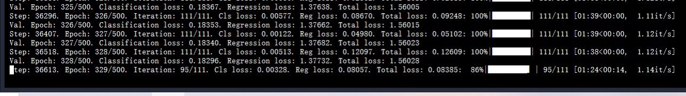

**注意 Efficientdet 模型特别消耗显存，16GB的显存，在Efficientdet -d3只能开batchsize为4**

**而d3模型的推理时间是比yolov5m和s久的，但是效果是没有V5好的，大家可以看这副图**

 (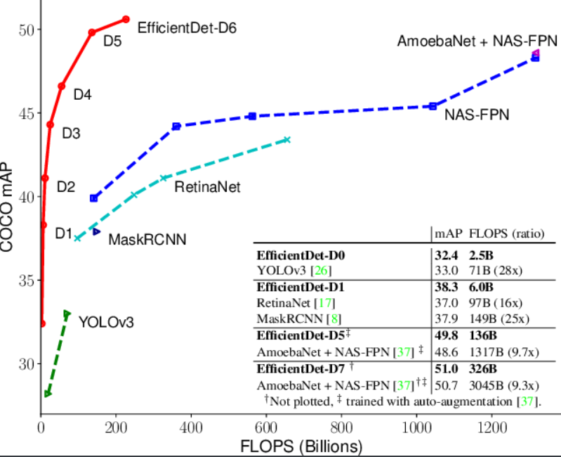 

## 模型推理

```python
compound_coef = 3
force_input_size = None  # set None to use default size
img_path = 'test/072.jpg'

# replace this part with your project's anchor config
anchor_ratios = [(1.0, 1.0), (1.4, 0.7), (0.7, 1.4)]
anchor_scales = [2 ** 0, 2 ** (1.0 / 3.0), 2 ** (2.0 / 3.0)]

threshold = 0.2
iou_threshold = 0.2

use_cuda = True
use_float16 = False
cudnn.fastest = True
cudnn.benchmark = True
```

同样这个compound_coef = 3要与你的网络一致~

threshold = 0.2调节来获取更好的体验。

然后直接执行就可以啦，由于只是用了500张数据集，后续慢慢加~


(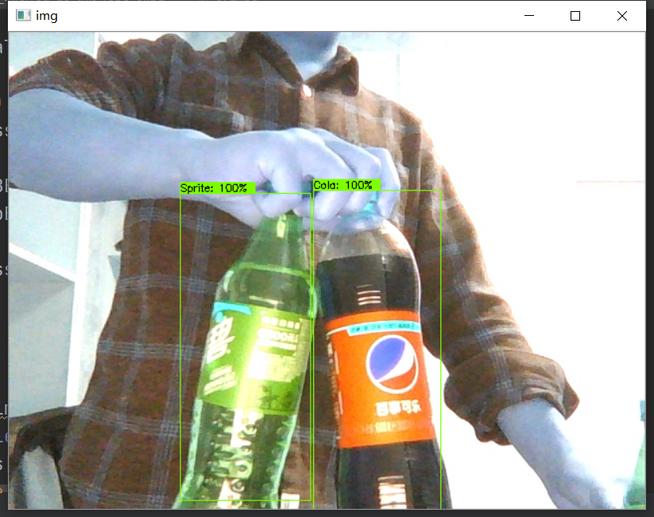


## 模型介绍

(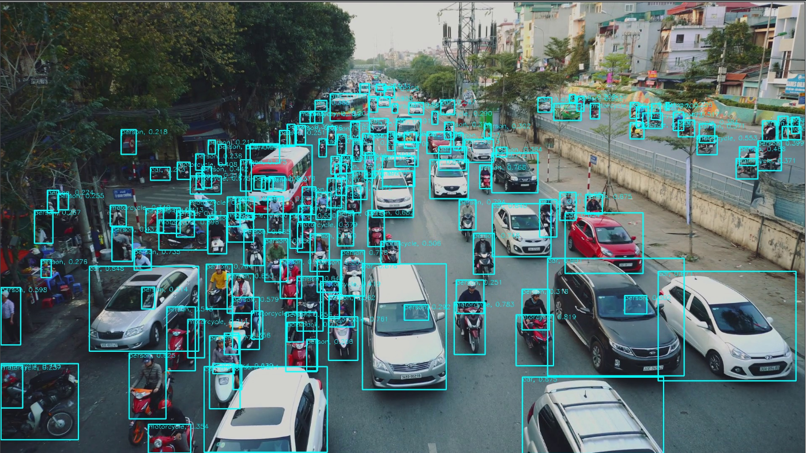

 这篇文章的主要贡献点是 BiFPN，Compound Scaling 两部分，会在下面一一介绍。


### BiFPN

(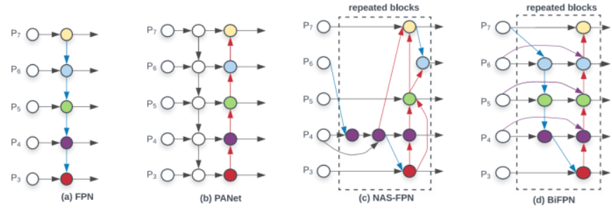

CVPR 2017 的 [FPN](https://link.zhihu.com/?target=https%3A//arxiv.org/abs/1612.03144)  指出了不同层之间特征融合的重要性，并且以一种比较简单，Heuristic 的方法把底层的特征乘两倍和浅层相加来融合。之后人们也试了各种别的融合方法，比如 [PANet](https://link.zhihu.com/?target=https%3A//arxiv.org/abs/1803.01534)  先从底向上连，再自顶向下连回去；[M2Det](https://link.zhihu.com/?target=https%3A//arxiv.org/abs/1811.04533) 在连的时候加入 skip-connection； [Libra-RCNN](https://link.zhihu.com/?target=https%3A//arxiv.org/abs/1904.02701) 先把所有feature 都汇聚到中间层，然后再 refine。

总之上述都是一些人工连连看的设计，包含 Conv，Sum，Concatenate，Resize，Skip Connection 等候选操作。很明显使用哪些操作、操作之间的顺序是可以用 NAS 搜的。进入 Auto ML 时代之后，[NAS-FPN](https://link.zhihu.com/?target=https%3A//arxiv.org/abs/1904.02701)  珠玉在前，搜到了一个更好的 neck 部分的结构。

本文的作者基于下面的观察结果/假设，进一步进行了优化： 

1. 作者观察到 [PANet](https://link.zhihu.com/?target=https%3A//arxiv.org/abs/1803.01534)  的效果比 [FPN](https://link.zhihu.com/?target=https%3A//arxiv.org/abs/1612.03144)  ，[NAS-FPN](https://link.zhihu.com/?target=https%3A//arxiv.org/abs/1904.02701) 要好，就是计算量更大； 
2. 作者从 [PANet](https://link.zhihu.com/?target=https%3A//arxiv.org/abs/1803.01534)  出发，移除掉了只有一个输入的节点。这样做是假设只有一个输入的节点相对不太重要。这样把 [PANet](https://link.zhihu.com/?target=https%3A//arxiv.org/abs/1803.01534)   简化，得到了上图 (e) Simplified PANet 的结果； 
3. 作者在相同 level 的输入和输出节点之间连了一条边，假设是能融合更多特征，有点 skip-connection 的意味，得到了上图 (f) 的结果； 
4. [PANet](https://link.zhihu.com/?target=https%3A//arxiv.org/abs/1803.01534)   只有从底向上连，自顶向下两条路径，作者认为这种连法可以作为一个基础层，重复多次。这样就得到了下图的结果（看中间的 BiFPN Layer  部分）。如何确定重复几次呢，这是一个速度和精度之间的权衡，会在下面的Compound Scaling 部分介绍。 

(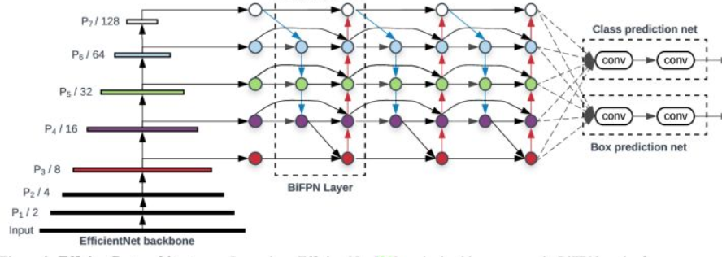

 **BiFPN 相对 FPN 能涨 4 个点，而且参数量反而是下降的，如下表所示。** 

(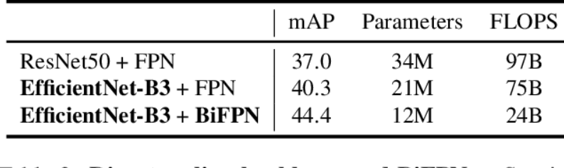

### Cross-Scale Connections

此外，作者还提出，之前从[FPN](https://link.zhihu.com/?target=https%3A//arxiv.org/abs/1612.03144) 开始普遍采用的，一个特征先 Resize  ，再和另一层的特征相加的方式不合理。因为这样假设这两层的特征有了相同的权重。从更复杂的建模角度出发，应该每一个 feature  在相加的时候都要乘一个自己的权重。这样 weighted 的方式能涨 0.4，如下表所示： 

(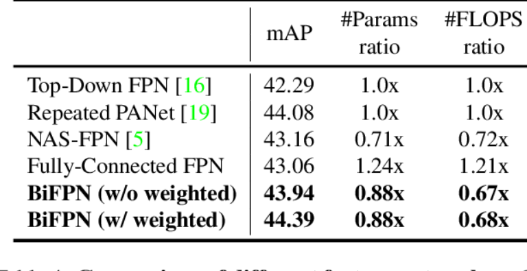

 

## 后续思路

Efficientdet 之所以能拿现在最高AP的sota，必然是有着过人之处的，例如使用了优秀的BIFPN，然而他的代价是可想而知的，需要极大的显存来训练，需要很久的时间来拟合，后续我会仔细研究BIFPN ，让其他模型大放异彩！

最后附赠上**github**传送门：https://github.com/CVUsers/Smart-Retail-By-Efficientdet

以及我的公众号：**DeepAI 视界**  

公众号回复**智能零售**可以领取数据模型哦

=======
这两天我CV调包侠帮助自己深度学习交流群的朋友做一个智能零售的企业级项目，我帮助他完成了零售商品检测的基本迭代一，已经轻松地完成了Yolo系列的训练，比如Yolov5 和Yolov3，Efficientdet是一个优秀的目标检测算法，速度与精度并存的实时性目标检测算法，我们今天就手把手教学一次，小白也能懂~，接触不久，如有错误，请指出。github传送门：https://github.com/CVUsers/Smart-Retail-By-Efficientdet
欢迎star

在这里插入图片描述在这里插入图片描述

在这里插入图片描述
何为Efficientdet

这里引用：https://zhuanlan.zhihu.com/p/98784755

introduction介绍了两大挑战：（1）高效的多尺度特征融合，FPN之后，PANet、NAS-FPN提出跨尺度的特征融合，但是之前的工作是直接将它们无差别得加起来，作者认为不同尺度特征图重要性不同，因此提出加权双向FPN，权值是可以学习的参数。（2）模型缩放，类似于efficientnet，对模型分辨率、深度、宽度联合缩放。本文核心方法BiFPN+compound scaling（联合缩放）

img图1 Feature network design

3.2 跨尺度连接

​ 由于PANet的accuracy比FPN和NAS-FPN更高，但是也有更高的计算量和参数量，因此文本提出了几种优化方法：（1）由于只有一条输入边的连接没有特征融合的功能，因此直接删掉，得到图1(e)。（2）在同尺度特征图上加入了一个输入到输出的连接（如果没有的话），在增加很少计算量的情况下就融合特征，得到图1(f)，（3）不同于PANet只有一条top-down和一条bottom-up路径，本文将这个结构视为一个特征网络层，并将这一特征网络层重复多次得到更高层次的特征融合。整个网络结构如图2所示。

img图2 EfficientDet architecture

3.3 加权特征融合

之前的工作在不同分辨率的特征图融合的时候往往是直接resize，再相加，这将所有输入的贡献视为相同的。本文总结了3种加权feature fusion方法，（1）unbound fusion 是learnable权重，是一个标量（对每个特征图），向量（对每个通道），tensor（对每个像素），弊端：由于权重unbound，训练不稳定。（2）将之前的权重经过softmax转换到0~1，但是实验表明在CPU上计算很慢。（3）本文提出的快速正则化融合,因为经过了ReLU激活函数，号称在CPU上比sofemax快30%。

经过BiFPN和fast normalized fusion，以图1(f)中的 为例，feature fusion如图3所示

img图3

4.2 Combound Scaling

联合缩放是为了accuracy和efficiency的tradeoff，之前的工作大多放大backbone、输入图片、或者堆叠更多的FPN，这些工作只放大其中的一项，是比较低效的。因此本文提出一种联合缩放方法，来联合放大backbone、BiFPN、分类/回归子网络和分辨率。（1）backbone复用了efficientnet-B0至B6。（后面不想写了，意义不大）

img图4 缩放后的模型尺寸

感受：

（1）. batch size=128，用了32个TPUv3训的model，直接和YOLOv3比似乎有点不公平，最终efficientDet-B0也不一定能超过YOLOv3很多，看之后源码和模型吧

（2）. 这个计算量一般人做不了，有时间还是多研究一下YOLOv3吧

大家可以看一下Efficientdet的疯狂刷榜：
[外链图片转存失败,源站可能有防盗链机制,建议将图片保存下来直接上传(img-9xsWmldY-1605525589726)(D:\CSDN\pic_new\v5优化\1605434444396.png)]

话不多说 开始训练
1 数据准备

由于cv调包侠这几天台式机有任务了，我便使用了开源的服务器：天池的服务器进行一个baseline的训练，我使用的是朋友自己标注的数据：可乐与雪碧检测与识别。

请看测试集与效果~

[外链图片转存失败,源站可能有防盗链机制,建议将图片保存下来直接上传(img-JrasB7ov-1605525589727)(D:\CSDN\pic_new\v5优化\1605436838784.png)]

只是做了个baseline，其中这还有一份数据集：大型零售商品检测识别的数据集，还标注好了哟~客官请看，后续可以用大型数据做训练

在这里插入图片描述
在这里插入图片描述
在这里插入图片描述
数据标注
附上自己的Lablimg简易教学：

[外链图片转存失败,源站可能有防盗链机制,建议将图片保存下来直接上传(img-ctuoGjSX-1594698054796)(D:\CSDN\pic\吸烟检测\7.png)]

标注好会生成XML文件：XML里面包含了四个点坐标和图片的名字与size。

然后就会获取xml文件（这幅图是以前吸烟检测的时时候做的，一个道理~）
将XML转换成COCO JSON格式

代码我跑已经写好了，见github中：https://github.com/CVUsers/Smart-Retail-By-Efficientdet

中data/coco2017下的2COCO.py

def DIOR_Dataset(image_path, annotation_path, start_image_id=0, start_id=0):
    categories_dict = generate_categories_dict(DIOR_CATEGORIES)

    imgname = os.listdir(image_path)
    images_dict = generate_images_dict(imgname, image_path, start_image_id)

    print('GENERATE_ANNOTATIONS_DICT...')
    annotations_dict = []
    id = start_id
    for i in images_dict:
        image_id = i['id']
        image_name = i['file_name']
        annotation_xml = annotation_path + image_name.split('.')[0] + '.xml'

        tree = ET.parse(annotation_xml)
        root = tree.getroot()

        for j in root.findall('object'):
            category = j.find('name').text
            print(category)
            category_id = DIOR_CATEGORIES.index(category)
            x_min = float(j.find('bndbox').find('xmin').text)
            y_min = float(j.find('bndbox').find('ymin').text)
            w = float(j.find('bndbox').find('xmax').text) - x_min
            h = float(j.find('bndbox').find('ymax').text) - y_min
            bbox = [x_min, y_min, w, h]
            dict = {'image_id': image_id, 'iscrowd': 0, 'bbox': bbox, 'category_id': category_id + 1, 'id': id}
            annotations_dict.append(dict)
            id = id + 1
    print('SUCCESSFUL_GENERATE_DIOR_JSON')
    return {COCO_DICT[0]: images_dict, COCO_DICT[1]: annotations_dict, COCO_DICT[2]: categories_dict}

    1
    2
    3
    4
    5
    6
    7
    8
    9
    10
    11
    12
    13
    14
    15
    16
    17
    18
    19
    20
    21
    22
    23
    24
    25
    26
    27
    28
    29
    30
    31
    32

这里就是xml转json的函数，看到我们35行写了

DIOR_CATEGORIES = ['Sprite', 'Cola']
parser = argparse.ArgumentParser(description='2COCO')
parser.add_argument('--image_path', type=str, default='./train2017/', help='config file')
parser.add_argument('--annotation_path', type=str, default='./annotations/', help='config file')
parser.add_argument('--dataset', type=str, default='DIOR', help='config file')
parser.add_argument('--save', type=str, default='./instances_train2017.json', help='config file')

    1
    2
    3
    4
    5
    6
    7

**就是指类别为2类，名字为雪碧和可乐，另外把数据地址写好~**生成train2017.json

同样的我们将验证集也放进来生成val2017.json

这两个json会生成到annotations文件夹下。
安装依赖

安装pytorch 和torchvision就行，版本的话，不是特别高或特别低的都行，我在1.3和1.5.1跑过

特别不同的是，要装pycocotools，建议查询一下windows安装方法，或者在ubuntu下安装，我是在阿里云平台装的，没有bug，win10有。
模型训练

在train.py 中

    parser = argparse.ArgumentParser('Yet Another EfficientDet Pytorch: SOTA object detection network - Zylo117')
    parser.add_argument('-p', '--project', type=str, default='coco', help='project file that contains parameters')
    parser.add_argument('-c', '--compound_coef', type=int, default=0, help='coefficients of efficientdet')
    parser.add_argument('-n', '--num_workers', type=int, default=0, help='num_workers of dataloader')
    parser.add_argument('--batch_size', type=int, default=12, help='The number of images per batch among all devices')
    parser.add_argument('--head_only', type=boolean_string, default=False,
                        help='whether finetunes only the regressor and the classifier, '
                             'useful in early stage convergence or small/easy dataset')
    parser.add_argument('--lr', type=float, default=1e-4)
    parser.add_argument('--optim', type=str, default='adamw', help='select optimizer for training, '
                                                                   'suggest using \'admaw\' until the'
                                                                   ' very final stage then switch to \'sgd\'')
    parser.add_argument('--num_epochs', type=int, default=500)
    parser.add_argument('--val_interval', type=int, default=1, help='Number of epoches between valing phases')
    parser.add_argument('--save_interval', type=int, default=500, help='Number of steps between saving')
    parser.add_argument('--es_min_delta', type=float, default=0.0,
                        help='Early stopping\'s parameter: minimum change loss to qualify as an improvement')
    parser.add_argument('--es_patience', type=int, default=0,
                        help='Early stopping\'s parameter: number of epochs with no improvement after which training will be stopped. Set to 0 to disable this technique.')
    parser.add_argument('--data_path', type=str, default='datasets/', help='the root folder of dataset')
    parser.add_argument('--log_path', type=str, default='logs/')
    parser.add_argument('-w', '--load_weights', type=str, default=None,
                        help='whether to load weights from a checkpoint, set None to initialize, set \'last\' to load last checkpoint')
    parser.add_argument('--saved_path', type=str, default='logs/')
    parser.add_argument('--debug', type=boolean_string, default=False,
                        help='whether visualize the predicted boxes of training, '
                             'the output images will be in test/')

    args = parser.parse_args()
    return args


    1
    2
    3
    4
    5
    6
    7
    8
    9
    10
    11
    12
    13
    14
    15
    16
    17
    18
    19
    20
    21
    22
    23
    24
    25
    26
    27
    28
    29
    30
    31
    32
    33

python train.py

    1

开始训练

–compound_coef就是看你使用上面预训练模型了

注意，你使用什么预训练模型，推理就要使用相关的网络，他不像Yolov5 ，Yolov5s和，m l x是同一个模型，只是模型的宽度和深度不一样，Efficientnet 是有差距的，即：你使用Efficientdet -d0的网络训练出来的模型，使用d1去推理是会报错的。

–w 就是一个使用预训练权重了，如果你写成last就是继续训练(不小心中断后可以继续接着训练)

[外链图片转存失败,源站可能有防盗链机制,建议将图片保存下来直接上传(img-pOIzkKq7-1605525589734)(D:\CSDN\pic_new\v5优化\1605451796387.png)]

注意 Efficientdet 模型特别消耗显存，16GB的显存，在Efficientdet -d3只能开batchsize为4

而d3模型的推理时间是比yolov5m和s久的，但是效果是没有V5好的，大家可以看这副图

img
模型推理

compound_coef = 3
force_input_size = None  # set None to use default size
img_path = 'test/072.jpg'

# replace this part with your project's anchor config
anchor_ratios = [(1.0, 1.0), (1.4, 0.7), (0.7, 1.4)]
anchor_scales = [2 ** 0, 2 ** (1.0 / 3.0), 2 ** (2.0 / 3.0)]

threshold = 0.2
iou_threshold = 0.2

use_cuda = True
use_float16 = False
cudnn.fastest = True
cudnn.benchmark = True

    1
    2
    3
    4
    5
    6
    7
    8
    9
    10
    11
    12
    13
    14
    15

同样这个compound_coef = 3要与你的网络一致~

threshold = 0.2调节来获取更好的体验。

然后直接执行就可以啦，由于只是用了500张数据集，后续慢慢加~

[外链图片转存失败,源站可能有防盗链机制,建议将图片保存下来直接上传(img-ofvVKNSH-1605525589738)(D:\CSDN\pic_new\v5优化\1605453221583.png)]
模型介绍

[外链图片转存失败,源站可能有防盗链机制,建议将图片保存下来直接上传(img-18HpknFX-1605525589745)(D:\CSDN\pic_new\v5优化\1605452938129.png)]

这篇文章的主要贡献点是 BiFPN，Compound Scaling 两部分，会在下面一一介绍。
BiFPN

img

CVPR 2017 的 FPN 指出了不同层之间特征融合的重要性，并且以一种比较简单，Heuristic 的方法把底层的特征乘两倍和浅层相加来融合。之后人们也试了各种别的融合方法，比如 PANet 先从底向上连，再自顶向下连回去；M2Det 在连的时候加入 skip-connection； Libra-RCNN 先把所有feature 都汇聚到中间层，然后再 refine。

总之上述都是一些人工连连看的设计，包含 Conv，Sum，Concatenate，Resize，Skip Connection 等候选操作。很明显使用哪些操作、操作之间的顺序是可以用 NAS 搜的。进入 Auto ML 时代之后，NAS-FPN 珠玉在前，搜到了一个更好的 neck 部分的结构。

本文的作者基于下面的观察结果/假设，进一步进行了优化：

    作者观察到 PANet 的效果比 FPN ，NAS-FPN 要好，就是计算量更大；
    作者从 PANet 出发，移除掉了只有一个输入的节点。这样做是假设只有一个输入的节点相对不太重要。这样把 PANet 简化，得到了上图 (e) Simplified PANet 的结果；
    作者在相同 level 的输入和输出节点之间连了一条边，假设是能融合更多特征，有点 skip-connection 的意味，得到了上图 (f) 的结果；
    PANet 只有从底向上连，自顶向下两条路径，作者认为这种连法可以作为一个基础层，重复多次。这样就得到了下图的结果（看中间的 BiFPN Layer 部分）。如何确定重复几次呢，这是一个速度和精度之间的权衡，会在下面的Compound Scaling 部分介绍。

img

BiFPN 相对 FPN 能涨 4 个点，而且参数量反而是下降的，如下表所示。

img
Cross-Scale Connections

此外，作者还提出，之前从FPN 开始普遍采用的，一个特征先 Resize ，再和另一层的特征相加的方式不合理。因为这样假设这两层的特征有了相同的权重。从更复杂的建模角度出发，应该每一个 feature 在相加的时候都要乘一个自己的权重。这样 weighted 的方式能涨 0.4，如下表所示：

img
后续思路

Efficientdet 之所以能拿现在最高AP的sota，必然是有着过人之处的，例如使用了优秀的BIFPN，然而他的代价是可想而知的，需要极大的显存来训练，需要很久的时间来拟合，后续我会仔细研究BIFPN ，让其他模型大放异彩！

最后附赠上github传送门：https://github.com/CVUsers/Smart-Retail-By-Efficientdet

以及我的公众号：DeepAI 视界

公众号回复智能零售可以领取数据模型哦

在这里插入图片描述

>>>>>>> bc0bd08dfab87e076c66c8ca9d55de6b081ad27a
